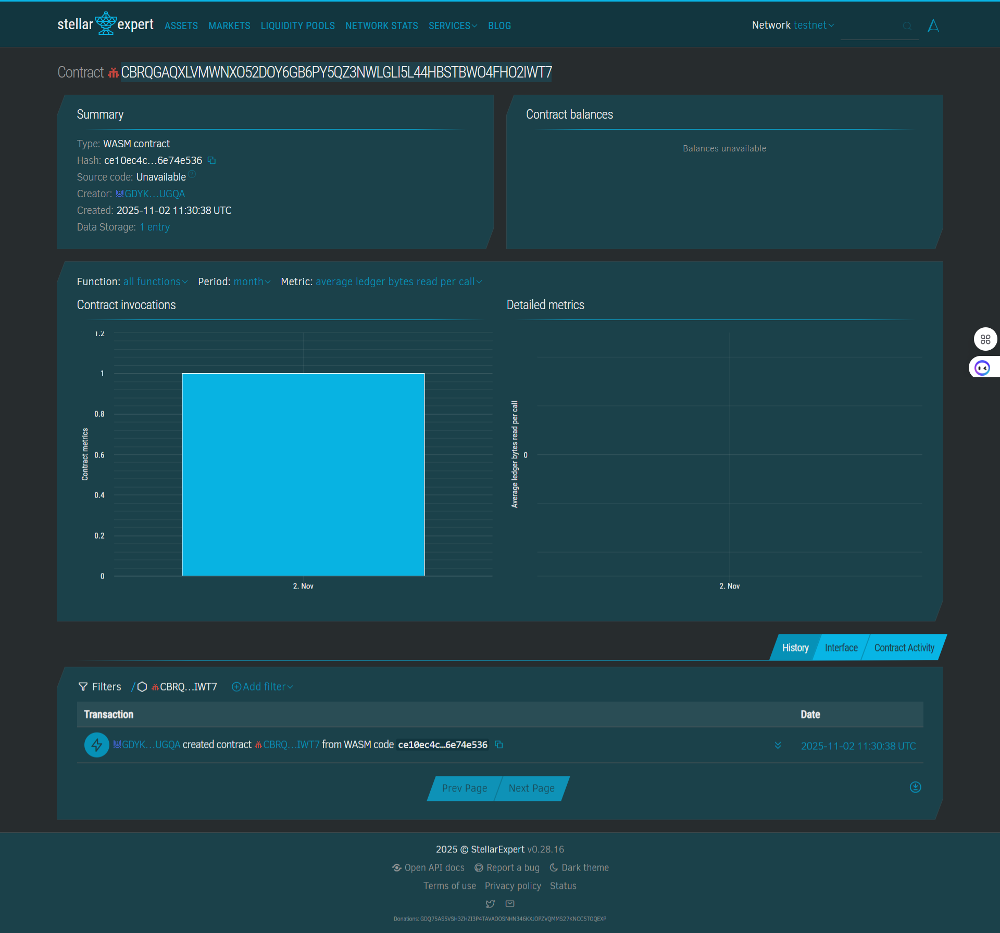

Project Title: SecureTag

Project Description

Anonymous Item Recovery

A decentralized application that connects a physical QR tag to a Stellar smart contract, enabling secure and anonymous communication for recovering lost items.

Project Vision

The "Stellar SecureTag" project aims to solve the classic lost-and-found problem by prioritizing the owner's privacy. In the real world, writing your name, phone number, or email on your luggage or keys exposes your personal information to everyone.

This project replaces that personal information with an anonymous Tag ID (linked to a QR code). This ID connects to a Soroban smart contract on the Stellar blockchain. A finder can scan the QR code to open a simple webpage, which allows them to anonymously flag the item as "found" and leave a message (like "at the library") on the blockchain. The owner can then check the status of their item and retrieve it, all without ever revealing their identity to the finder.

Key Features

This smart contract provides the core logic for the "SecureTag" system and is built around four simple functions:

register(owner: Address, tag_id: Symbol)

What it does: This is the one-time setup function for an item owner. It creates a new, permanent record on the blockchain that links a unique tag_id (e.g., "MY_BAG_123") to the owner's wallet Address (e.g., "G...").

Security: This function requires authorization from the owner, meaning only you can register a tag to your own wallet.

report(tag_id: Symbol, message: Symbol)

What it does: This is the anonymous "finder" function. Anyone can call it without any authorization.

How it works: A finder scans the QR code, which opens a webpage. The webpage calls this function, passing in the tag_id and a message (e.g., "at_reception"). The contract updates the tag's status to "found" and saves the message.

claim(tag_id: Symbol)

What it does: This is an owner-only function to reset the item's status. After the owner has recovered their item, they call this function to set the tag's status back to "ok" and clear the finder's message.

Security: This function requires authorization from the item's original owner, preventing the finder or a stranger from resetting the tag.

get_tag(tag_id: Symbol) -> Tag

What it does: This is a public, "read-only" function. Anyone (especially the owner) can call it to check the current status of an item.

Output: It returns the complete Tag data struct, which includes the owner's address, the status ("ok" or "found"), and the message (e.g., "at_library").

Future Scope

This simple smart contract serves as the "backend" for a much larger application. Future enhancements could include:

Web Frontend: Build a simple index.html file (like we did before) that allows users to call these functions from a user-friendly interface instead of the command line.

Finder Rewards: Add a function where the owner can deposit XLM into the contract as a "reward," which is automatically sent to the finder's wallet address when they report an item.

NFT Integration (ERC-721): Instead of just a Tag struct, each registered item could be a unique NFT. The owner's wallet would "hold" the NFT, and the contract would manage its status metadata.

Dynamic Messages: Allow the finder to write a custom String message instead of just a Symbol, which would require using Bytes or String types in the contract.

##contract details -
Contractid:CBRQGAQXLVMWNXO52DOY6GB6PY5QZ3NWLGLI5L44HBSTBWO4FHO2IWT7

